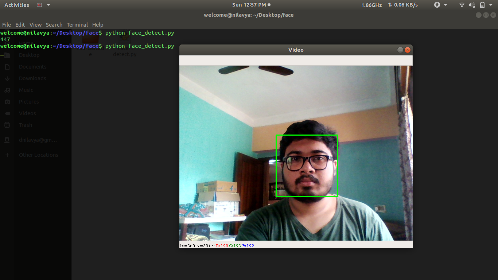

# Face Detection <br>
## About the Project: - 
<p><i>
  This main aim of this project is to build an application that detects human faces and counts the number of faces in the frame and can also be used to detect number of persons entering or moving out from a specfic place. 
  </i>
</p>

## Language used: - 
[Python3](https://docs.python.org/3/)<br>
#### Note: <br>
Make Tab for indentation (tab = 3 spaces), and afer writing a code use the comment to describe the code ``` # add comment ```

## FrameWorks: -
1. [Open-cv](https://pypi.org/project/opencv-python/) (version: 4.2.0) <br>
```pip install opencv-python ```
2. [Numpy](https://numpy.org/doc/) (version: 1.18.3)<br>
``` pip install numpy```


### Here's an example of face detection done by the model.. 


<p> </p>
